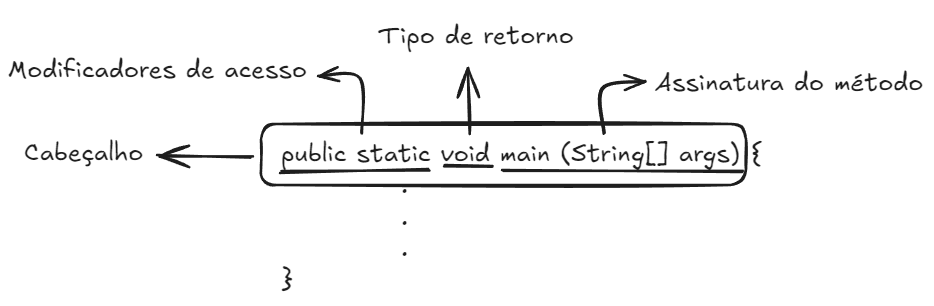

# Entendendo Java

<div align="center">


</div>

## Hello World

A linguagem de programação Java é baseada em classes. Na qual, a partir das classes, pode-se criar objetos (instâncias das classes).

A seguir vemos um exemplo de código em Java.

```java
class HelloWorld {
    public static void main (String[] args) {
        System.out.println("Hello, World!");
    }
}
```

Para rodar scripts em Java, deve-se ter instalado o Java JDK (Java Develoment Kit) na máquina. É importante destacar que o nome da classe deve ser idêntica ao nome do arquivo.

Para compilar o código acima, deve-se digitar o seguinte comando no terminal:

```
javac HelloWorld.java
```

Em seguida, deve-se executar o programa, digitando o seguinte comando:

```
java HelloWorld
```

Assim, após a execução do programa, é esperado que imprima ```Hello, World!``` no terminal.

O método ```main``` é um método especial responsável por executar tudo que está em seu escopo.

A seguir temos os seguintes alguns nomes que acompanham o método ```main```:

- ```public```: modificador de acesso, na qual qual um pode acessar o método ```main```;
- ```static```: significa que o método pertence a classe e não está associado a nenhuma outra instância da classe;
- ```void```: indica que o método é uma função que não retorna valor.

O nome de um método junto com a lista de parâmetros é chamado de ```Assinatura do método```. Enquanto a Assinatura, os modificadores de acesso, o tipo de retorno e as exceções são o ```Cabeçalho do método```.



Após declaração corretamente o cabeçalho, temos o bloco de comando ```System.out.println("Hello, World!");``` que imprime "Hello, World!".

## Construtor de Classe

O construtor de classe é um bloco declarado com o mesmo nome que a classe. É como uma rotina de inicialização que é chamado sempre que um objeto é criado.

    Um construtor não é um método, só é chamado na construção de um objeto e não tem retorno.

```java
    public class Livro{
        String nome;
        String descricao;
        String isbn;
        double valor;

        public Livro(){ // Construtor da classe Livro

        }

        // métodos da classe
    }
```

Toda vez que há um ```new```, invoca-se o construtor.

```java
    Livro livro1 = new Livro(); // Chamando o construtor da classe Livro
```

Quando um construtor não é declarado na classe, o Java cria o ```construtor Default```, sem argumento e com corpo vazio.
Quando se declara um construtor, o ```construtor Default``` não é criado.

Um construtor pode receber argumentos, inicializando um com algum tipo de informação.

```java
    public class Livro{
        String nome;
        String descricao;
        String isbn;
        double valor;

        public Livro(double valor){ // Construtor da classe Livro
            this.valor = valor;
        }

        // métodos da classe
    }
```

Assim, ao ser invocado, o construtor dessa classe precisa de um parâmetro para ser inicializado.

```java
    public class Cadastro{
        public static void main(String[] args){
            Livro livro1 = new Livro(1.0); // Chamando o construtor da classe Livro

            livro1.nome = "Olha o Livro 1 ai!";
            livro1.descricao = "Um livro ai pra tu ver";
            livro1.isbn = "100-200-3000";
            livro1.valor = 199.90;

            // ...
        }
    }
```